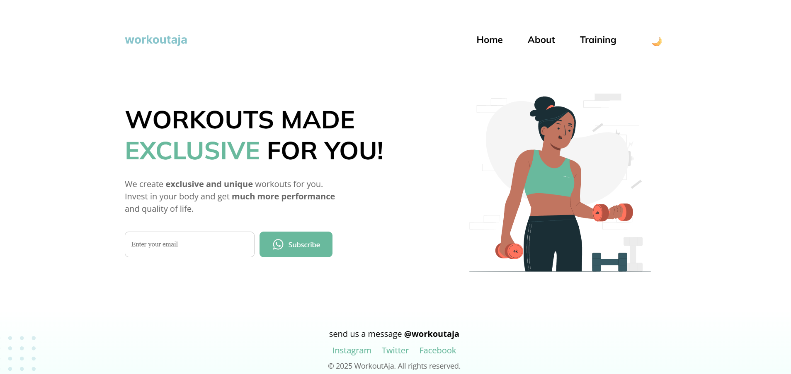

# with React Hooks deployed on vercel https://neo-1.vercel.app/
A fitness landing page enhanced with React Hooks, featuring dark/light mode toggle and interactive elements.
[](https://bit.ly/3Stx0RP)


[](https://neo-1.vercel.app/)
## 📱 Screenshots
### Light Mode

### Dark Mode

## ✨ Features
- **Theme Toggling** - Switch between light and dark mode with localStorage persistence
- **Responsive Design** - Optimized layout for all device sizes
- **Email Subscription Form** - Interactive form with validation
- **Animation Effects** - Smooth transitions and fade-in effects
## 🔧 React Hooks Implementation
The project demonstrates several React Hooks:
- **useState** - Managing component state (theme, form inputs, success messages)
- **useEffect** - Handling side effects (localStorage, DOM updates, animations)
- **Custom Hooks**:
  - `useTheme` - Theme management with persistent storage
  - `useWindowSize` - Responsive layout adaptation
## 🏗️ Project Structure
```
react-hooks-workout/
├── public/
│   └── imgs/
│       ├── logo.svg
│       ├── woman.svg
│       └── balls.svg
├── src/
│   ├── components/
│   │   ├── Navbar.jsx
│   │   ├── Hero.jsx
│   │   └── Footer.jsx
│   ├── hooks/
│   │   ├── useTheme.js
│   │   └── useWindowSize.js
│   ├── App.jsx
│   └── main.jsx
├── index.html
└── style.css
```
## 📝 Implementation Details
### Custom Hooks
The `useTheme` hook demonstrates the power of custom hooks by:
- Managing theme state
- Synchronizing with localStorage
- Providing a simple toggle function
```jsx
// Example of useTheme hook
function useTheme() {
  const [theme, setTheme] = useState(() => {
    return localStorage.getItem('theme') || 'light';
  });
  useEffect(() => {
    localStorage.setItem('theme', theme);
    document.body.className = theme;
  }, [theme]);
  const toggleTheme = () => {
    setTheme(prevTheme => prevTheme === 'light' ? 'dark' : 'light');
  };
  return { theme, toggleTheme };
}
```
### Component Structure
Components use hooks to manage their state and side effects:
```jsx
// Example of Navbar component with hooks
function Navbar({ toggleTheme, currentTheme }) {
  const { isMobile } = useWindowSize();
  const [menuOpen, setMenuOpen] = useState(false);
  
  // Close menu when switching from mobile to desktop
  useEffect(() => {
    if (!isMobile) {
      setMenuOpen(false);
    }
  }, [isMobile]);
  return (
    // Component JSX
  );
}
```
## 🚀 Getting Started
1. Clone the repository
2. Install dependencies: `npm install`
3. Start the development server: `npm run dev`
4. Open your browser to `http://localhost:5173`
## 📚 Learn More
For a detailed explanation of React Hooks implementation, check out my article:
[Mastering React Hooks: A Comprehensive Guide for Modern Web Development](https://bit.ly/3Stx0RP)
---